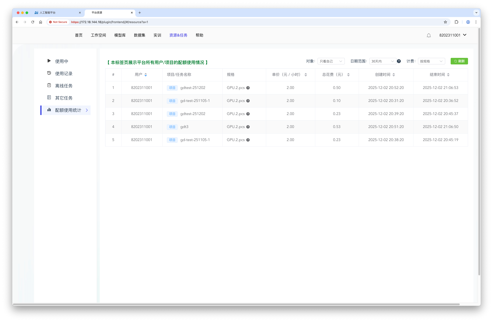
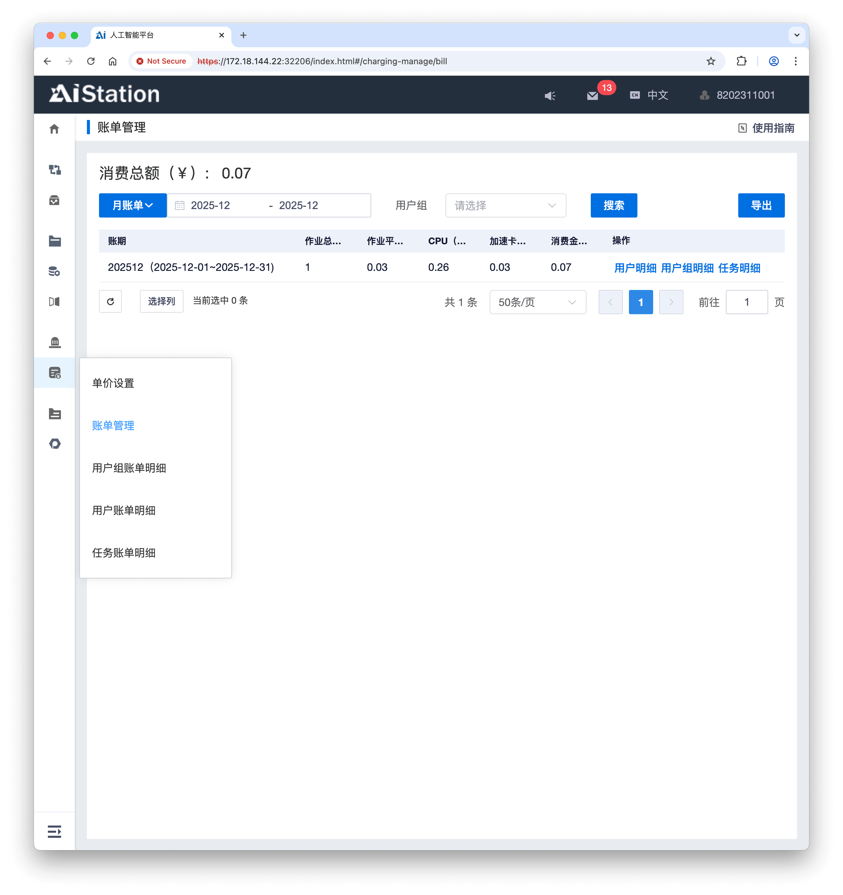

# 人工智能算力平台
{: .no_toc }

  

    目录
  

  {: .text-delta }
1. TOC
{:toc}

关于学院算力平台的使用说明。

## 使用简要说明

下载链接：[算力平台使用简要说明-v1.30-221107](./aicp.assets/算力平台使用简要说明-v1.30-251107.pdf)

## 费用查看
### L40费用查看

L40 的费用，可在 `资源&任务 | 配额使用统计` 中查看。

### A100费用查看

A100 的费用，可在 `计费管理 | 账单管理` 中查看。

