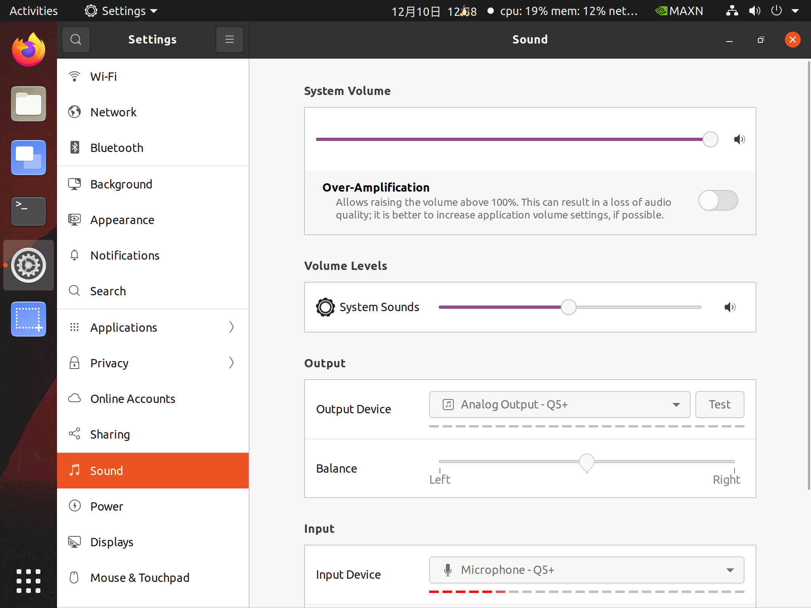

# 机械臂开发示例-251218
{: .no_toc }

[上次实验课](./imrobot251211.md) 通过 Python 程序实现对机械臂的语音控制。本地实验课将实现一个 Web 界面，在 Web 界面上语音控制机械臂。


<details open markdown="block">
  <summary>
    目录
  </summary>
  {: .text-delta }
1. TOC
{:toc}
</details>

<hr>

## 相关说明

**相关信息获取**

- elephant-ai 源代码。[点击下载](./imrobot251211.assets/elephant-ai-251211.zip)
- 开发板账号密码（如需要用到）：`jetson` / `yahboom`
- 开发板IP地址。开发板透明窗口顶部的小屏幕显示的 `IPA: 172.18.xxx.xxx`，就是IP地址。或者在 `终端(terminal)` 执行命令 `ifconfig | grep 172` 也可获得。

**建议事项**

- 接电源线时，从六边形桌子的中央六边形孔洞穿线到桌面上。不要从桌子边缘穿线到桌面上。
- 机械臂电源拔出时，用手扶着机械臂，自然卧倒在开发板上面即可。不要折叠机械臂。
- 断电时，拔掉桌面上相关设备的电源接口即可。不必拔下桌子下面的插头。

{: .important-title}
> 实验结束离开时：
>
> 1、椅子复位。放到桌子下面。<br>
> 2、关机并拔掉电源。在开发板 `终端(terminal)` 执行命令 `shutdown -h now` 后，从开发板透明窗口观察并等待散热风扇停止，然后拔掉机械臂电源、开发板电源、显示屏电源。 

<hr>

## 参考方案

分析过程，和 [上次实验的分析过程](./imrobot251211.md/#参考方案) 类似，此处从略。直接列出参考方案如下：

- （和下面的方法，二选一即可）**[方法1]** 在开发板上启动一个 `终端(Terminal)`，执行 `sudo python3 agent2.py -v`。（命令行参数 `-v`  是告知开发板处理语音文件的意思。）
- （和上面的方法，二选一即可）**[方法2]** 或者，在开发板上启动一个 `终端(Terminal)`，修改 `config.json` 中 `voice` 配置为 `voice: true`，然后执行 `sudo python3 agent.py`。

- 在开发板上，再启动一个 `终端(Terminal)`，运行 `grall.py`（待编写），并在浏览器打开 `localhost:7860`，实现将麦克风说的话，生成 `Recording.flac` 语音文件，供机械臂识别语音并执行相关动作。


<hr>

## 步骤一：新建目录获取 elephant-ai 代码（建议）

1、用 `jetson` 账号登录开发板后，在 `jetson` 账号的 HOME 目录新建子目录 `ailab`，并切换到子目录 `ailab`。

```bash
cd
pwd # 命令执行结果应显示 /home/jetson
mkdir ailab
cd ailab
pwd # 命令执行结果应显示 /home/jetson/ailab
```

2、下载 elephant-ai 源码：[点击下载](./imrobot251211.assets/elephant-ai-251211.zip)

3、从 HOME 目录下的 `Downloads` 子目录，复制 `elephant-ai-251211.zip` 到当前目录 `ailab` 中，然后执行 `unzip` 解压缩。

```bash
jetson@jetson-Yahboom:~/ailab$ cp ~/Downloads/elephant-ai-251211.zip .
jetson@jetson-Yahboom:~/ailab$ unzip elephant-ai-251211.zip
```

4、验证样例代码是否工作正常。放几个积木到带 + 的方框中（比如绿色、蓝色积木，颜色面朝上），执行 `python3 agent2.py` （或者 `python3 agent.py`）启动样例程序。稍后出现 `<USER>:` 提示符，然后输入比如  `grab green cube and move to 0,200`，查看机械臂动作是否符合预期。

{: .highlight-title}
> 关于 `sudo python3 agent.py` 还是 `python3 agent.py`
> 1、sudo 是 Linux 系统中的一个重要命令，它的全称是 "superuser do"。这个命令允许经过验证的用户以其他用户的身份来运行命令，通常是以超级用户（root）的身份运行命令。<br>
> 2、由于开发板环境安装差异（今后将统一），部分开发板仍需要加 `sudo` 才能执行，即使 [新复制代码](#新建目录获取-elephant-ai-代码建议) 以后，否则报 `openAI` 相关错误。<br>
> 3、如需要加 `sudo` 才能执行成功，则 `grall.py`（待编写） 也按 `sudo python3 grall.py` 执行。

```bash
jetson@jetson-Yahboom:~/ailab/elephant-ai-251211$ python3 agent2.py
WARNING: Carrier board is not from a Jetson Developer Kit.
WARNNIG: Jetson.GPIO library has not been verified with this carrier board,
WARNING: and in fact is unlikely to work correctly.
进入交互模式...
<USER>:grab green cube and move to 0,200
<LLM>:✿FUNCTION✿: grab_object
✿ARGS✿: {"object_name": "绿色方块"}
✿FUNCTION✿: move_to
✿ARGS✿: {"target_coord": [0, 200], "target_height": 110}
functions_and_args: [('grab_object', {'object_name': '绿色方块'}), ('move_to', {'target_coord': [0, 200], 'target_height': 110})]
#################### <函数执行> ####################
Image saved as captured_image.jpg
[{'x1': 408, 'x2': 589, 'y1': 745, 'y2': 980}]
像素坐标 (319.04, 414.0) 对应的机械臂坐标为: [144.7   2.1]
#################### <函数执行> #################### 

#################### <函数执行> ####################
*************
[0, 200]
Objects arranged successfully
#################### <函数执行> #################### 

<USER>:
```

{: .important}
如果抓取不大精确，可参考：[抓不准该如何调整](./ailabkit.md/#抓不准该如何调整) 做调整。

<hr>

## 步骤二：环境准备

Gradio 是一个开源 Python 包，允许你快速为你的机器学习模型、API 或任何任意 Python 函数构建一个演示或 Web 应用程序。然后，你可以使用 Gradio 内置的共享功能，在几秒钟内分享你的演示或 Web 应用程序的链接。无需 JavaScript、CSS 或 Web 托管经验！（来源：[Gradio 快速入门](https://gradio.org.cn/guides/quickstart)）

NLP实验箱也采用 Gradio 构建 Web 界面。因此本实验采用 Gradio 来构建语音相关的 Web 界面。

Gradio 需要 Python 3.10 的环境。如果开发板上不是 3.10 （通常是 3.8），则可以通过安装 `conda` 来创建一个 Python 3.10 的虚拟环境。不直接升级 Python 3.8 到 Python 3.10，以免导致其他应用无法运行。

```bash
python3 --version # 比如输出显示 Python 3.8.10
```

安装和启动 `conda` 虚拟环境步骤如下：

**1、执行 `conda`，确认 `conda` 是否已安装。如已安装，可跳过第2步。**

**（如已安装请跳过此步）2、如果尚未安装 `conda`，则依次执行以下命令安装并激活：**

```bash
cd # 切换到 jetson 用户的 HOME 目录
mkdir tmp2512 # 新建临时目录用于下载安装包
cd tmp2512
pwd # 执行结果应显示 /home/jetson/tmp2512

# 从科大镜像下载安装包
wget https://mirrors.ustc.edu.cn/github-release/conda-forge/miniforge/LatestRelease/Miniforge3-Linux-aarch64.sh

# 安装过程中，请仔细阅读提示。并在询问“是否初始化Miniforge3”时输入 yes。
bash Miniforge3-Linux-aarch64.sh

# 安装完成后，关闭并重新打开终端，或者执行以下命令使配置生效：
source ~/.bashrc

# 之后，你的命令行前会出现 (base) 字样，表示基础环境已激活。
```

**3、创建Python 3.10虚拟环境**

执行以下命令创建 Python 3.10 的虚拟环境：

```bash
conda create -n gdpy310 python=3.10
```
- `-n gdpy310` 指定了环境名称，你可以自定义（如 `zspy310`、`lspy310`、`wwpy310`，等）。
- `python=3.10` 指定了要安装的Python版本。

**4、激活虚拟环境**

环境创建完成后，使用以下命令激活它：（以虚拟环境名字是 `gdpy310` 为例）

```bash
conda activate gdpy310
```

**`conda activate 虚拟环境名` 和 `conda deactivate 虚拟环境名`，可激活/去激活相应 Python 虚拟环境：**

```bash
jetson@jetson-Yahboom:~$ python3 --version
Python 3.8.10
jetson@jetson-Yahboom:~$ conda activate base
(base) jetson@jetson-Yahboom:~$ python3 --version
Python 3.12.12
(base) jetson@jetson-Yahboom:~$ conda activate gdpy310
(gdpy310) jetson@jetson-Yahboom:~$ python3 --version
Python 3.10.19
(gdpy310) jetson@jetson-Yahboom:~$ conda deactivate
(base) jetson@jetson-Yahboom:~$ conda deactivate
jetson@jetson-Yahboom:~$ 
```

## 步骤三：尝试 Web 界面录制 WAV 文件

和大模型交互后得到如下样例代码:

```python
# grwav.py

import gradio as gr
import numpy as np
import soundfile as sf # 导入soundfile库
from datetime import datetime

def save_audio(audio):
    """
    处理录制的音频并保存为WAV文件。
    audio参数是一个元组: (采样率, 音频数据numpy数组)
    """
    if audio is None:
        return "未检测到音频输入。"

    sample_rate, audio_data = audio

    # 1. 生成带时间戳的唯一文件名，避免覆盖
    timestamp = datetime.now().strftime("%Y%m%d_%H%M%S")
    filename = f"recording_{timestamp}.wav"

    # 2. 保存为WAV文件
    sf.write(filename, audio_data, sample_rate)

    # 3. 计算音频时长
    duration = len(audio_data) / sample_rate

    return f"✅ 音频已保存为：{filename}\n采样率：{sample_rate}Hz，时长：{duration:.2f}秒"

# 创建界面
demo = gr.Interface(
    fn=save_audio,
    inputs=gr.Audio(sources="microphone", type="numpy", label="点击开始录音", format="wav"),
    outputs="text",
    title="Jetson麦克风录音器",
    description="录音将自动保存为带时间戳的WAV文件。"
)

# 启动应用（允许局域网访问）
if __name__ == "__main__":
    demo.launch(server_name="0.0.0.0", server_port=7860)
```

- 在实验目录（比如 `/home/jetson/elephant-ai-251211`）中新建文件 `grwav.py`, 复制上述代码到文件中。

- 执行命令激活 Python 虚拟环境（以 `gdpy310`）

```bash
jetson@jetson-Yahboom:~$ conda activate gdpy310
(gdpy310) jetson@jetson-Yahboom:~$ 
```

- 执行以下命令启动后端程序

```bash
python3 grwav.py
```

- 打开 FireFox 浏览器，输入网址：`localhost:7860`

- 测试是否可以录音。

{: .highlight-title}
> 假定没有录音不成功，可以检查 `Settings | sound` 相关设置是否恰当。<br>
> - System Volume 是否足够大<br>
> - Volume Levels 是否足够大<br>
> - Output 是否选择合适的设备，并点击 `Test` 做测试，听听是否有声音播放。<br>
> - Input 是否选择合适的设备，并对着麦克风说话，查看下方红色虚线是否足够长。期望红色虚线较长。<br>
> 
> 


## 录音（和播放）

### 尝试录音

1、和大模型（比如 DeepSeek 等）交互，比如：`jetson开发板，ubuntu系统，接了USB麦克风和喇叭，怎么把对麦克风说的话，保存为音频文件，保存为wav格式，并回放。请输出python代码样例。`

2、大模型建议首先安装依赖的库：

```bash
sudo apt-get update
sudo apt-get install libportaudio2 portaudio19-dev python3-dev  # sounddevice的依赖
pip3 install sounddevice numpy scipy
```

3、并给出了样例代码。新建文件 `q5test.py` ，保存到开发板的 `/home/jetson/ailab/elephant-ai-251211` 目录中，先录音试试。

```python
import sounddevice as sd
import numpy as np
from scipy.io.wavfile import write as write_wav
import subprocess
import os

# ========== 核心参数配置 (根据你的设备信息已优化) ==========
# 录音设备参数
INPUT_DEVICE = 'pulse'  # 使用你的USB麦克风硬件地址
OUTPUT_DEVICE = 'pulse'  # 使用你的USB麦克风硬件地址
# INPUT_DEVICE = 'plughw:3,0'  # 使用你的USB麦克风硬件地址
SAMPLE_RATE = 44100          # 采样率 (Hz)，与你的设备匹配
DURATION = 5                 # 录音时长 (秒)
CHANNELS = 1                 # 声道数，单声道兼容性最好
OUTPUT_FILENAME = 'recording.wav'

# ========== 主程序：录音、保存、回放 ==========
def record_and_playback():
    print(f"准备录音 {DURATION} 秒...")
    print(f"输入设备: {INPUT_DEVICE}, 采样率: {SAMPLE_RATE}Hz")
    
    try:
        # 1. 录制音频
        print("▶️ 开始录音...")
        audio_data = sd.rec(int(DURATION * SAMPLE_RATE),
                            samplerate=SAMPLE_RATE,
                            channels=CHANNELS,
                            dtype='int16',        # 16位PCM格式[citation:5]
                            device=INPUT_DEVICE)
        sd.wait()  # 等待录音结束
        print("✅ 录音结束。")
        
        # 尝试播放刚录制的音频
        print("正在播放录音...")
        sd.play(audio_data, SAMPLE_RATE, device=OUTPUT_DEVICE)
        sd.wait()
        print("播放结束。")
        
        # 2. 处理数据形状 (避免后续问题)
        if audio_data.ndim > 1 and audio_data.shape[1] == 1:
            audio_data = audio_data.squeeze()
        
        # 3. 保存为WAV文件
        write_wav(OUTPUT_FILENAME, SAMPLE_RATE, audio_data)
        print(f"💾 音频已保存为: {OUTPUT_FILENAME}")
        
        # 4. 验证并回放
        print("\n正在尝试播放录音...")
        if os.path.exists(OUTPUT_FILENAME):
            # 方法1: 使用系统命令aplay播放 (最可靠)[citation:4]
            print("🎵 使用系统音频设备播放...")
            try:
                subprocess.run(['aplay', '-D', 'default', OUTPUT_FILENAME], check=True)
            except subprocess.CalledProcessError:
                # 方法2: 备用方案，使用sd.play进行Python内部播放
                print("⚠️  系统播放失败，尝试内部播放...")
                sd.play(audio_data, SAMPLE_RATE)
                sd.wait()
            print("✅ 播放完成。")
        else:
            print("❌ 错误：录音文件未生成。")
            
    except Exception as e:
        print(f"❌ 程序出错: {e}")

if __name__ == "__main__":
    # 可选：运行前列出所有音频设备，方便调试
    print("=== 可用的音频设备 ===")
    print(sd.query_devices())
    print("=" * 30)
    
    record_and_playback()
```

假定没有录音不成功，可以检查 `Settings | sound` 相关设置是否恰当。
- System Volume 是否足够大
- Volume Levels 是否足够大
- Output 是否选择合适的设备，并点击 `Test` 做测试，听听是否有声音播放。
- Input 是否选择合适的设备，并对着麦克风说话，查看下方红色虚线是否足够长。期望红色虚线较长。


### 录音文件保存为 `flac` 格式

- 继续和大模型交互，尝试将语音录制为 `flac` 文件。一种可行的选项是用 `ffmpeg` 将 `wav` 文件转换为 `flac` 文件。

- 可积极尝试其他可行的方法。

- 参考样例代码：[q5flac.py](./imrobot251211.assets/q5flac.py)

### 录制为 `Recording.flac`

参考样例代码：[q5.py](./imrobot251211.assets/q5.py)

<hr>

## 用语音指挥机械臂

1. 在开发板上启动 `终端(terminals)`，并切换到实验目录中，然后运行 `python3 agent2.py -v`。也可以运行 `python3 agent.py`，运行之前先修改 `config.json` 中 `voice` 为 `voice:true`。

2. 在开发板上再新启动 `终端(terminals)`，并切换到实验目录中，然后运行 `python3 q5.py`，开始录音说话。比如，`抓取蓝色方块，并移动到 -80,200`。

3. 可以尝试更多语音，比如：
  - `抓取鱼骨头，并移动到0,200`
  - `把 6 个积木排成圆圈`
  - ……

{: .note}
至此，实验主要任务基本完成。

<hr>

## 拓展任务（可选）

1. 完善录音代码 `q5.py`，比如：
  - 执行 `python3 q5.py` 后，就一直运行。直到同时按下 `ctrl` 和 `c` 退出。
  - 按某个键开始录音，然后说话录音，录音完成后按某个键此次结束录音。当前录音固定长度 x 秒。

2. 优化机械臂代码 `agent2.py` （或 `agent.py`），比如：
  - 提示正在等待 `Recording.flac`。当前界面提示不友好。
